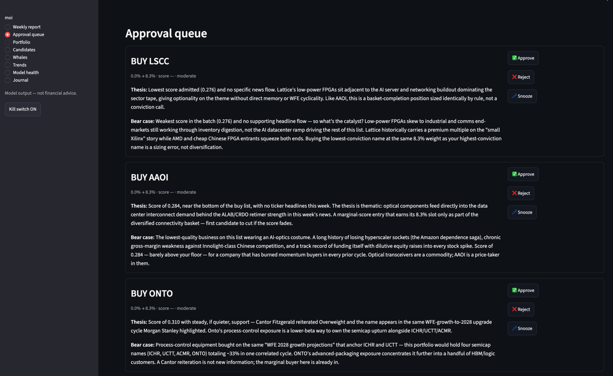

# my-own-investor (`moi`)

**An AI-assisted, human-approved portfolio copilot for Interactive Brokers.**

`moi` scans markets, SEC filings, prediction markets, and news for a focused universe of
small/mid-cap **hardware companies** (AI compute, data-center power & cooling, optical
interconnect, networking, storage, fab equipment). Once a week it ranks candidates with a
validated quantitative signal, lets Claude agents argue the bull *and* bear case for every
proposed trade, and queues suggestions on a dashboard. **Nothing ever trades without your
explicit per-order approval** — and a stack of hard-coded safety rails beneath that.



## How it works

```
nightly            weekly (Saturday)                            you
───────            ─────────────────────────────────────────    ──────────────
collectors   ──►   features ──► composite score ──► portfolio   dashboard:
prices, 13F,       (point-in-time, leakage-tested)  (regime-    review thesis
insiders,                                            scaled,    + bear case,
Polymarket,        Claude agents: analyst theses,    sector     approve/reject
news, FRED         red-team bear cases, PM summary   caps)      → moi execute
```

- **Data** — daily prices (yfinance/IBKR), whale 13F holdings with quarter-over-quarter
  diffs and insider Form 4s (SEC EDGAR), congressional trades (optional, Quiver/Unusual
  Whales), Polymarket event probabilities, RSS news, FRED macro. All idempotent upserts
  into a single DuckDB file.
- **Signal** — a zero-parameter cross-sectional rank composite (52-week-high proximity,
  26/52-week momentum, small-size tilt). Out-of-sample rank-IC ≈ 0.06 (t ≈ 3.8) under
  purged walk-forward evaluation; a LightGBM challenger is evaluated alongside and gets
  promoted only if it beats the composite out-of-sample (so far it hasn't — by a lot).
- **Judgment** — LLM agents (Claude Agent SDK) narrate and critique the numbers; they
  never compute them and have no trading tools. Every suggestion carries a thesis *and*
  a specific bear-case objection.
- **Execution** — approval queue → `moi execute` places limit-GTC orders on a **paper
  account only** (live requires an explicit config unlock, intended after months of
  paper evaluation).

## Safety model

Enforced in code, covered by tests, and proven against a live gateway:

1. Only `APPROVED` suggestions are executable — approval is a human click, always
2. Ticker whitelist: active universe members only, benchmark ETFs excluded
3. No shorting — sells capped at held quantity
4. Per-order and per-day dollar caps
5. A kill switch (`moi kill on`) that blocks everything
6. Paper accounts (`DU…`) only, unless `allow_live` is explicitly set

## Quickstart

```bash
conda env create -f environment.yaml && conda activate my-own-investor
pip install -e ".[dev]"

cp .env.example .env            # set MOI_EDGAR_IDENTITY (+ optional API keys)
moi db init
moi collect all                 # prices, filings, Polymarket, news, macro
moi weekly --no-llm             # first report without LLM narration
moi dashboard                   # browse it
```

Full setup (IBKR gateway, API keys, nightly/weekly scheduling): **[docs/SETUP.md](docs/SETUP.md)**

## CLI at a glance

| Command | What it does |
|---|---|
| `moi collect all` | Refresh every data source (nightly job) |
| `moi weekly [--collect]` | Full pipeline → suggestions + markdown report |
| `moi dashboard` | Streamlit UI: report, approval queue, portfolio, whales, trends |
| `moi ml scores` / `moi ml train` | Latest ranking / composite-vs-challenger evaluation |
| `moi backtest run` | Walk-forward backtest vs baselines (gated) |
| `moi approve/reject <id>` | Decide a suggestion (also available in the UI) |
| `moi execute` | Place approved orders (paper only; all rails apply) |
| `moi orders --sync` | Reconcile fills with the broker |
| `moi watch` | Urgent triggers: big moves, fresh whale filings, data quality |
| `moi kill on\|off` | Kill switch |
| `moi status` | Data-freshness board |

## Project documentation

- **[docs/PLAN.md](docs/PLAN.md)** — architecture, data sources, ML design, related work
- **[docs/IMPLEMENTATION.md](docs/IMPLEMENTATION.md)** — phased build plan with acceptance
  gates (phases 0–4 complete; phase 5 = paper-trade evaluation in progress)
- **[docs/SETUP.md](docs/SETUP.md)** — environment, IBKR, scheduling
- `docs/backtests/` — dated, reproducible backtest reports

Weekly reports (`reports/`) and all market/portfolio data (`data/`) are private and
git-ignored — they contain personal financial information.

## Honesty notes

The backtest window covers a single (bullish) regime, and the hand-curated universe
implies survivorship bias in *absolute* returns — the strategy-vs-universe comparison is
the fair one. Congressional-trade and 13F data arrive with mandated disclosure lags and
are treated as features, never copy-trade signals.

## Disclaimer

This is a personal research tool. Its output is model-generated and **not financial
advice**. Markets can and will take your money; nothing here changes that. Use at your
own risk, paper-trade first, and read the bear cases.

## License

[MIT](LICENSE)
